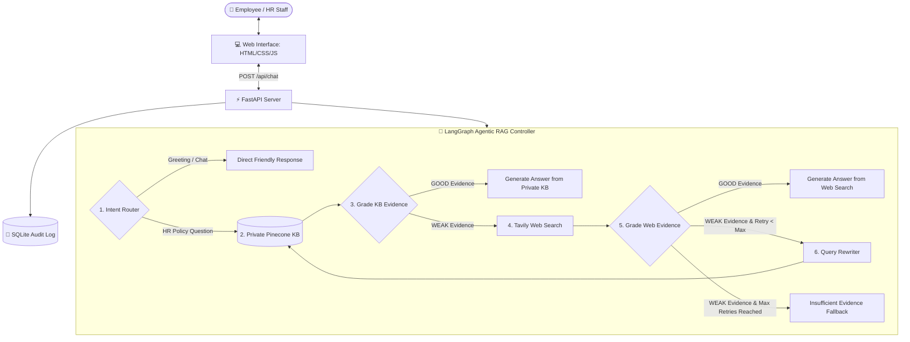

# 🏢 Enterprise HR Policy & Employee Support Agentic RAG Copilot — Complete Guide

---

## 📌 1. Executive Summary: What is this Project?

The **Enterprise HR Policy & Employee Support Agentic RAG Copilot** is an enterprise-grade AI assistant built specifically for human resources (HR) departments and company employees. 

Unlike standard AI chatbots (which can hallucinate or give generic answers) or basic RAG systems (which blindly search a database and return whatever text chunks match), this system uses **Agentic RAG (Retrieval-Augmented Generation)** orchestrated via **LangGraph**. 

It intelligently acts as an autonomous agent that:
1. **Understands Intent**: Decides whether a question is a simple greeting or an HR policy inquiry.
2. **Prioritizes Private Knowledge**: Searches company HR documents (leave policies, remote work guidelines, payroll, benefits, conduct codes) stored in a secure vector database (**Pinecone**).
3. **Self-Evaluates & Grades Evidence**: Uses LLM-based grading to verify if the retrieved company policy actually answers the user's specific question.
4. **Falls Back to External Search**: If the internal knowledge base lacks information (e.g., current government labor regulations, public holiday dates), it autonomously queries the web via **Tavily Search**.
5. **Self-Corrects & Rewrites Queries**: If queries are ambiguous or fail retrieval, it reformulates the query with HR keywords and retries.
6. **Maintains Audit Logs & Full Traceability**: Logs every decision and displays the exact thought trace to users for enterprise compliance and debugging.

---

## 🎯 2. What Problem Is It Solving?

### The Business Context
In a mid-to-large enterprise (e.g., *NovaRetail* with 3,000+ employees), HR departments are overwhelmed with repetitive inquiries regarding:
- Annual leave, sick leave, and rollover rules.
- Remote work allowances and office hours.
- Medical insurance, 401(k)/benefits enrollment.
- Payroll schedules and expense reimbursement.
- Disciplinary actions and ethics/conduct guidelines.

### The Pain Points & Limitations of Existing Solutions
| Traditional Approach | Limitation / Failure Mode |
| :--- | :--- |
| **Manual HR Ticketing / Email** | Slow response times; HR staff waste hours answering repetitive questions. |
| **Keyword Search Portals (SharePoint/Intranet)** | Returns dozens of dense PDF manuals; employees can't find specific answers quickly. |
| **Standard LLM Chatbot (ChatGPT alone)** | Hallucinates policies that do not exist; has no access to private company rules. |
| **Naive / Basic RAG** | Blindly retrieves top-k chunks and feeds them to the LLM. If the retrieved text is irrelevant or incomplete, the LLM hallucinates or gives misleading policy advice. |
| **Pure Internal RAG** | Completely fails when employees ask questions that rely on external laws, state regulations, or current public holidays. |

### The Goal
Provide an automated, reliable, and compliant HR Copilot that answers internal questions strictly from verified company documents, transparently searches external sources when needed with clear disclaimers, and refuses to answer rather than hallucinating when information is unavailable.

---

## 🛠️ 3. Technology Stack & Why Each Tool Was Chosen

| Technology / Library | Purpose in this Project | Why It Was Chosen |
| :--- | :--- | :--- |
| **LangGraph** (`langgraph`) | Multi-agent stateful workflow orchestrator | Allows building cyclical graphs with conditional routing, self-correction loops, and state persistence. |
| **OpenAI GPT-4o-mini** (`langchain-openai`) | LLM for routing, grading, rewriting, and generation | High intelligence, JSON-mode support, fast response times, and cost-effective inference. |
| **OpenAI Embeddings** (`text-embedding-3-small`) | Vector embeddings generation (1536 dimensions) | State-of-the-art semantic representation of enterprise HR documentation text. |
| **Pinecone** (`pinecone`, `langchain-pinecone`) | Serverless Cloud Vector Database | Scalable, low-latency similarity search for enterprise knowledge bases with namespace isolation. |
| **Tavily Search API** (`langchain-tavily`) | AI-optimized web search engine | Returns clean, contextual search snippets and answers without web-scraping noise. |
| **FastAPI** (`fastapi`, `uvicorn`) | High-performance asynchronous backend API | Provides REST endpoints (`/api/chat`, `/api/ingest`, `/api/health`) and OpenAPI docs. |
| **Pydantic & Settings** (`pydantic`, `pydantic-settings`) | Data validation and configuration management | Enforces type safety for structured JSON outputs and environment variables. |
| **Document Loaders** (`pypdf`, `python-docx`, `langchain-community`) | Multi-format document parser | Extracts raw text from `.pdf`, `.docx`, `.txt`, and `.md` HR policy documents. |
| **SQLite** (`sqlite3`) | Audit trail & decision logging | Lightweight, zero-setup relational store for compliance, tracking user queries and agent trace paths. |
| **HTML5 / CSS3 / Vanilla JS** | Web User Interface | Lightweight, responsive front-end featuring real-time Agent Trace visualizer and document uploader. |
| **Docker** | Containerization | Ensures reproducible deployment across cloud environments. |

---

## 🧠 4. How Everything Works: System Architecture & Workflow

### A. High-Level System Architecture



---

## 🔬 5. Deep Dive: The 6-Step Agentic RAG Lifecycle

Let's examine what happens step-by-step when an employee asks a question in the background:

### Step 1: Intent Routing (`route_question`)
* **File:** `app/rag/workflow.py`
* **What happens:** The user's input string is inspected by an LLM with structured output (`RouteDecision`).
* **Logic:**
  - If the user says *"Hello"*, *"Good morning"*, or *"Thanks"*, it routes to `direct_answer` (no retrieval needed).
  - If the user asks about leave, benefits, payroll, conduct, remote work, or general policies, it routes to `retrieve_kb`.

### Step 2: Private Knowledge Base Retrieval (`retrieve_kb`)
* **File:** `app/rag/vectorstore.py` & `app/rag/workflow.py`
* **What happens:**
  - Converts `current_query` into vector embeddings using `text-embedding-3-small`.
  - Queries Pinecone index (`fde-hr-policy-rag`, namespace `company-hr-kb`) using cosine similarity.
  - Retrieves the top $k=4$ most relevant text chunks.

### Step 3: Private KB Evidence Grading (`grade_kb`)
* **File:** `app/rag/workflow.py`
* **What happens:**
  - An LLM grader evaluates the retrieved chunks against the original question using structured output (`EvidenceGrade`).
  - **Decision:**
    - `GOOD`: If the private documents contain complete, unambiguous details to answer the question $\rightarrow$ Proceeds to `generate_from_kb`.
    - `WEAK`: If the private documents do not contain the answer or are only tangentially related $\rightarrow$ Triggers fallback to `search_web`.

### Step 4: External Web Fallback Search (`search_web`)
* **File:** `app/rag/workflow.py`
* **What happens:**
  - If company documents did not have the answer (for example, *“What are the latest national holiday rules in Bangladesh?”*), the agent calls the **Tavily Search API**.
  - Collects external search results, title, content snippets, and source URLs.

### Step 5: Web Evidence Grading (`grade_web`)
* **File:** `app/rag/workflow.py`
* **What happens:**
  - The LLM grades the web search results.
  - **Decision:**
    - `GOOD`: Proceeds to `generate_from_web`.
    - `WEAK`: Checks if `retry_count < max_retries` (default: 1).
      - If retry allowed: Goes to `rewrite_query`.
      - If retry exceeded: Goes to `insufficient`.

### Step 6: Query Rewriter & Self-Correction Loop (`rewrite_query`)
* **File:** `app/rag/workflow.py`
* **What happens:**
  - When an ambiguous question fails retrieval (e.g., *“What happens if mine is wrong?”*), the rewriter LLM analyzes the question, preserves intent, injects HR domain terms, and increments `retry_count`.
  - The graph loops back to `retrieve_kb` with the newly formulated query.

### Step 7: Answer Generation & Citations
* **`generate_from_kb`**: Generates a grounded answer strictly based on internal company documents with source citations (e.g., `company_hr_handbook.md`).
* **`generate_from_web`**: Generates an answer citing external web sources and explicitly adds a compliance disclaimer: *"This is external public information and may require HR validation before being treated as company policy."*
* **`insufficient`**: Refuses to hallucinate: *"I couldn't find enough reliable evidence in the company HR knowledge base or external search to answer confidently. Please contact the HR team."*

---

## 📥 6. Document Ingestion & Vector Indexing Pipeline

How do documents get into the private Pinecone knowledge base?

```
[HR Document (.pdf, .docx, .txt, .md)]
                │
                ▼
      PyPDFLoader / TextLoader / docx.Document
                │
                ▼
  RecursiveCharacterTextSplitter (chunk_size=900, overlap=120)
                │
                ▼
   OpenAI Embeddings (text-embedding-3-small, 1536 dim)
                │
                ▼
  Pinecone Serverless Index ('fde-hr-policy-rag', namespace='company-hr-kb')
```

### Ingestion Details:
1. **Multi-format Support:** Handles `.pdf`, `.txt`, `.md`, and `.docx` (`app/services/ingestion.py`).
2. **Chunking Strategy:** `RecursiveCharacterTextSplitter` with `chunk_size=900` characters and `chunk_overlap=120` characters ensures sentences and policy clauses are not split abruptly while maintaining context.
3. **Automated Pinecone Index Provisioning:** `app/rag/vectorstore.py` checks if the Pinecone index exists; if not, it automatically creates a serverless index with AWS `us-east-1` region and `cosine` metric.
4. **Admin Upload Endpoint:** Authorized HR staff can upload new documents on-the-fly via `POST /api/ingest` using their `ADMIN_API_KEY`.

---

## 🔍 7. Audit Logging & Compliance Tracking

In enterprise HR, tracking what employees ask and what answers AI provides is essential for compliance and monitoring.

* **File:** `app/services/audit.py`
* **Database:** SQLite (`data/audit.db`)
* **Schema:**
  ```sql
  CREATE TABLE query_audit (
      id INTEGER PRIMARY KEY AUTOINCREMENT,
      created_at TEXT NOT NULL,
      question TEXT NOT NULL,
      source_used TEXT NOT NULL,
      trace_json TEXT NOT NULL
  );
  ```
* Every time a query is executed, the system logs:
  - Timestamp (UTC ISO format).
  - Raw employee question.
  - Final source used (`private_kb`, `web_search`, `direct`, `insufficient_evidence`).
  - Full execution trace of every node visited in LangGraph.

---

## 📂 8. Complete Project File Structure

```text
Enterprise-HR-Policy-Employee-Support-Agentic-RAG-Copilot/
│
├── app/                               # Core Application Package
│   ├── api/
│   │   └── routes.py                  # FastAPI Endpoints (/api/chat, /api/ingest, /api/health)
│   ├── core/
│   │   ├── config.py                  # Pydantic Settings & Environment Variables
│   │   └── logging.py                 # Centralized logging configuration
│   ├── rag/
│   │   ├── state.py                   # LangGraph TypedDict state & Pydantic models
│   │   ├── vectorstore.py             # Pinecone connection, index provisioning & embeddings
│   │   └── workflow.py                # LangGraph nodes, routing edges & execution graph
│   ├── services/
│   │   ├── audit.py                   # SQLite audit trail service
│   │   └── ingestion.py               # Document loading & text chunking pipeline
│   └── main.py                        # FastAPI application initialization & static mounting
│
├── data/
│   ├── audit.db                       # Auto-created SQLite audit database
│   └── sample_kb/                     # Default HR policy knowledge base files
│       ├── company_hr_handbook.md     # Annual leave, sick leave, remote work, payroll, benefits
│       └── hr_operations_runbook.md   # Employee onboarding, offboarding, records
│
├── static/                            # Frontend assets
│   ├── css/
│   │   └── style.css                  # Dark-themed enterprise UI stylesheet
│   └── js/
│       └── app.js                     # Chat UI logic, API calls, real-time trace rendering
│
├── templates/
│   └── index.html                     # Main Web UI template (Jinja2)
│
├── uploads/                           # Temporary directory for HR document uploads
├── Dockerfile                         # Container build configuration
├── ingest_sample_kb.py                # CLI script to batch-ingest sample KB files into Pinecone
├── requirements.txt                   # Project Python dependencies
├── run.py                             # Server entrypoint script (Uvicorn launcher)
└── README.md                          # Repository documentation
```

---

## 🚀 9. How to Setup, Ingest & Run Locally

### Step 1: Create Virtual Environment
```bash
python -m venv venv
# Windows:
venv\Scripts\activate
# macOS/Linux:
source venv/bin/activate
```

### Step 2: Install Dependencies
```bash
pip install -r requirements.txt
```

### Step 3: Configure Environment (`.env`)
Create a `.env` file in the root directory:
```env
OPENAI_API_KEY=sk-...your-openai-key...
TAVILY_API_KEY=tvly-...your-tavily-key...
PINECONE_API_KEY=pcsk-...your-pinecone-key...
PINECONE_INDEX_NAME=fde-hr-policy-rag
PINECONE_NAMESPACE=company-hr-kb
OPENAI_MODEL=gpt-4o-mini
EMBEDDING_MODEL=text-embedding-3-small
ADMIN_API_KEY=change-me-in-production
APP_ENV=development
```

### Step 4: Ingest the Sample HR Knowledge Base
Run the ingestion script to parse sample files and upload vectors to Pinecone:
```bash
python ingest_sample_kb.py
```

### Step 5: Start the Application
```bash
python run.py
```
- Open Web UI: `http://127.0.0.1:8080`
- Open Interactive API Docs (Swagger UI): `http://127.0.0.1:8080/docs`

---

## 🧪 10. Test Scenarios & Expected Agent Behaviors

| Scenario | Example Query | Expected Agent Path & Result |
| :--- | :--- | :--- |
| **1. Private KB Hit** | *"How many annual leave days do employees receive?"* | `Router → KB` $\rightarrow$ `Retrieve KB` $\rightarrow$ `Grade KB: GOOD` $\rightarrow$ `Generate from KB` (Answers 20 days with citation). |
| **2. Remote Work Policy** | *"How many days per week can I work remotely?"* | `Router → KB` $\rightarrow$ `Retrieve KB` $\rightarrow$ `Grade KB: GOOD` $\rightarrow$ `Generate from KB` (Answers 2 days with manager approval). |
| **3. External Public Law** | *"What are the latest public holiday rules in Bangladesh?"* | `Router → KB` $\rightarrow$ `Retrieve KB` $\rightarrow$ `Grade KB: WEAK` $\rightarrow$ `Tavily Search` $\rightarrow$ `Grade Web: GOOD` $\rightarrow$ `Generate from Web` (Answers with public info & HR validation disclaimer). |
| **4. Ambiguous / Self-Correction** | *"What happens if mine is wrong?"* | `Router → KB` $\rightarrow$ `Grade: WEAK` $\rightarrow$ `Grade Web: WEAK` $\rightarrow$ `Rewrite Query` $\rightarrow$ Retries KB $\rightarrow$ Returns safe insufficient evidence fallback instead of guessing. |
| **5. Casual Greeting** | *"Hi, good morning!"* | `Router → DIRECT` $\rightarrow$ `Direct Response` (Immediate friendly reply without database retrieval). |

---

## 💡 11. Key Takeaways & FDE Insights

This project demonstrates the core responsibilities of a **Forward Deployed Engineer (FDE)**:
1. **Domain Precision**: In HR and legal contexts, hallucinations carry legal and operational risks. Agentic self-grading ensures high fidelity.
2. **Graceful Fallback**: Combining private enterprise data with bounded web search solves the "stale internal knowledge" dilemma.
3. **Observability**: Exposing the internal decision-making graph in both UI and SQLite builds user trust and simplifies enterprise auditability.
